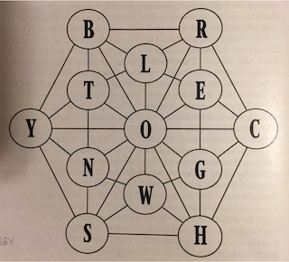

# Graph word finder
Find all words in this graph:

## Rules:
 - Start at any letter in the graph
 - Follow the lines to add letters
 - Can loop back to reuse letters
 - Can’t repeat a letter “in place” (no doubled letters)
 - No minimum or maximum length
 - Validate using word list (/usr/share/dict/words or similar)
 - Print out (or equivalent) all words meeting the above requirements
